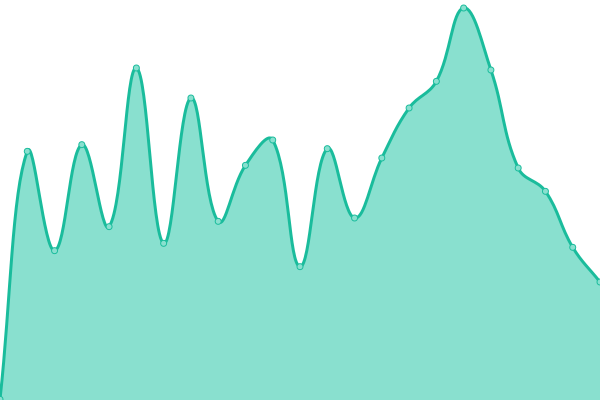

# [📈 Live Status](https://thinkintegrated-web.github.io/upptime): <!--live status--> **🟧 Partial outage**

This repository contains the open-source uptime monitor and status page for [thinkintegrated-web](https://thinkintegrated-web.github.io/upptime), powered by [Upptime](https://github.com/upptime/upptime).

With [Upptime](https://upptime.js.org), you can get your own unlimited and free uptime monitor and status page, powered entirely by a GitHub repository. We use [Issues](https://github.com/thinkintegrated-web/upptime/issues) as incident reports, [Actions](https://github.com/thinkintegrated-web/upptime/actions) as uptime monitors, and [Pages](https://thinkintegrated-web.github.io/upptime) for the status page.

<!--start: status pages-->
<!-- This summary is generated by Upptime (https://github.com/upptime/upptime) -->
<!-- Do not edit this manually, your changes will be overwritten -->
<!-- prettier-ignore -->
| URL | Status | History | Response Time | Uptime |
| --- | ------ | ------- | ------------- | ------ |
|  [bhpcchamber.org](https://www.bhpchamber.org) | 🟩 Up | [bhpcchamber-org.yml](https://github.com/thinkintegrated-web/upptime/commits/HEAD/history/bhpcchamber-org.yml) | 

 1001ms
     
 | 

<a href="https://thinkintegrated-web.github.io/upptime/history/bhpcchamber-org">100.00%</a>
    

|  [blacktipit.com](https://www.blacktipit.com) | 🟩 Up | [blacktipit-com.yml](https://github.com/thinkintegrated-web/upptime/commits/HEAD/history/blacktipit-com.yml) | 

 784ms
     
 | 

<a href="https://thinkintegrated-web.github.io/upptime/history/blacktipit-com">100.00%</a>
    

|  [ciaimaging.com](https://www.ciaimaging.com) | 🟩 Up | [ciaimaging-com.yml](https://github.com/thinkintegrated-web/upptime/commits/HEAD/history/ciaimaging-com.yml) | 

 1602ms
     
 | 

<a href="https://thinkintegrated-web.github.io/upptime/history/ciaimaging-com">100.00%</a>
    

|  [confettiandcreativity.com](https://www.confettiandcreativity.com) | 🟥 Down | [confettiandcreativity-com.yml](https://github.com/thinkintegrated-web/upptime/commits/HEAD/history/confettiandcreativity-com.yml) | 

 2399ms
     
 | 

<a href="https://thinkintegrated-web.github.io/upptime/history/confettiandcreativity-com">80.84%</a>
    

|  [congdonyards.com](https://www.congdonyards.com) | 🟩 Up | [congdonyards-com.yml](https://github.com/thinkintegrated-web/upptime/commits/HEAD/history/congdonyards-com.yml) | 

 1537ms
     
 | 

<a href="https://thinkintegrated-web.github.io/upptime/history/congdonyards-com">100.00%</a>
    

|  [crittercontroldallas.com](https://www.crittercontroldallas.com) | 🟩 Up | [crittercontroldallas-com.yml](https://github.com/thinkintegrated-web/upptime/commits/HEAD/history/crittercontroldallas-com.yml) | 

 195ms
     
 | 

<a href="https://thinkintegrated-web.github.io/upptime/history/crittercontroldallas-com">100.00%</a>
    

|  [cshpinnovation.com](https://www.cshpinnovation.com) | 🟩 Up | [cshpinnovation-com.yml](https://github.com/thinkintegrated-web/upptime/commits/HEAD/history/cshpinnovation-com.yml) | 

 1778ms
     
 | 

<a href="https://thinkintegrated-web.github.io/upptime/history/cshpinnovation-com">99.84%</a>
    

|  [destinyfamilyoffice.com](https://www.destinyfamilyoffice.com) | 🟩 Up | [destinyfamilyoffice-com.yml](https://github.com/thinkintegrated-web/upptime/commits/HEAD/history/destinyfamilyoffice-com.yml) | 

 4032ms
     
 | 

<a href="https://thinkintegrated-web.github.io/upptime/history/destinyfamilyoffice-com">100.00%</a>
    

|  [eventsatcongdonyards.com](https://www.eventsatcongdonyards.com) | 🟩 Up | [eventsatcongdonyards-com.yml](https://github.com/thinkintegrated-web/upptime/commits/HEAD/history/eventsatcongdonyards-com.yml) | 

 2116ms
     
 | 

<a href="https://thinkintegrated-web.github.io/upptime/history/eventsatcongdonyards-com">100.00%</a>
    

|  [integralandcompany.com](https://www.integralandcompany.com) | 🟩 Up | [integralandcompany-com.yml](https://github.com/thinkintegrated-web/upptime/commits/HEAD/history/integralandcompany-com.yml) | 

 1715ms
     
 | 

<a href="https://thinkintegrated-web.github.io/upptime/history/integralandcompany-com">100.00%</a>
    

|  [invernessmedicalimaging.com](https://www.invernessmedicalimaging.com) | 🟩 Up | [invernessmedicalimaging-com.yml](https://github.com/thinkintegrated-web/upptime/commits/HEAD/history/invernessmedicalimaging-com.yml) | 

 1177ms
     
 | 

<a href="https://thinkintegrated-web.github.io/upptime/history/invernessmedicalimaging-com">100.00%</a>
    

|  [jobspartnership.org](https://www.jobspartnership.org) | 🟩 Up | [jobspartnership-org.yml](https://github.com/thinkintegrated-web/upptime/commits/HEAD/history/jobspartnership-org.yml) | 

 1081ms
     
 | 

<a href="https://thinkintegrated-web.github.io/upptime/history/jobspartnership-org">100.00%</a>
    

|  [matthiaspw.com](https://www.matthiaspw.com) | 🟩 Up | [matthiaspw-com.yml](https://github.com/thinkintegrated-web/upptime/commits/HEAD/history/matthiaspw-com.yml) | 

 2397ms
     
 | 

<a href="https://thinkintegrated-web.github.io/upptime/history/matthiaspw-com">100.00%</a>
    

|  [msgrouponline.com](https://msgrouponline.com) | 🟩 Up | [msgrouponline-com.yml](https://github.com/thinkintegrated-web/upptime/commits/HEAD/history/msgrouponline-com.yml) | 

 346ms
     
 | 

<a href="https://thinkintegrated-web.github.io/upptime/history/msgrouponline-com">100.00%</a>
    

|  [nicholswealth.com](https://www.nicholswealth.com) | 🟩 Up | [nicholswealth-com.yml](https://github.com/thinkintegrated-web/upptime/commits/HEAD/history/nicholswealth-com.yml) | 

 608ms
     
 | 

<a href="https://thinkintegrated-web.github.io/upptime/history/nicholswealth-com">100.00%</a>
    

|  [orangeparkimaging.com](https://www.orangeparkimaging.com) | 🟩 Up | [orangeparkimaging-com.yml](https://github.com/thinkintegrated-web/upptime/commits/HEAD/history/orangeparkimaging-com.yml) | 

 1421ms
     
 | 

<a href="https://thinkintegrated-web.github.io/upptime/history/orangeparkimaging-com">99.64%</a>
    

|  [orlandoballet.org](https://www.orlandoballet.org) | 🟩 Up | [orlandoballet-org.yml](https://github.com/thinkintegrated-web/upptime/commits/HEAD/history/orlandoballet-org.yml) | 

 2037ms
     
 | 

<a href="https://thinkintegrated-web.github.io/upptime/history/orlandoballet-org">100.00%</a>
    

|  [semiconductorengine.org](https://www.semiconductorengine.org) | 🟩 Up | [semiconductorengine-org.yml](https://github.com/thinkintegrated-web/upptime/commits/HEAD/history/semiconductorengine-org.yml) | 

 1699ms
     
 | 

<a href="https://thinkintegrated-web.github.io/upptime/history/semiconductorengine-org">100.00%</a>
    

|  [srsradiology.com](https://www.srsradiology.com) | 🟩 Up | [srsradiology-com.yml](https://github.com/thinkintegrated-web/upptime/commits/HEAD/history/srsradiology-com.yml) | 

 1659ms
     
 | 

<a href="https://thinkintegrated-web.github.io/upptime/history/srsradiology-com">100.00%</a>
    

|  [starterstudio.org](https://www.starterstudio.org) | 🟩 Up | [starterstudio-org.yml](https://github.com/thinkintegrated-web/upptime/commits/HEAD/history/starterstudio-org.yml) | 

 1139ms
     
 | 

<a href="https://thinkintegrated-web.github.io/upptime/history/starterstudio-org">100.00%</a>
    

|  [cableelectrical.com](https://www.cableelectrical.com) | 🟩 Up | [cableelectrical-com.yml](https://github.com/thinkintegrated-web/upptime/commits/HEAD/history/cableelectrical-com.yml) | 

 907ms
     
 | 

<a href="https://thinkintegrated-web.github.io/upptime/history/cableelectrical-com">100.00%</a>
    

|  [unlimitedwelding.com](https://www.unlimitedwelding.com) | 🟩 Up | [unlimitedwelding-com.yml](https://github.com/thinkintegrated-web/upptime/commits/HEAD/history/unlimitedwelding-com.yml) | 

 958ms
     
 | 

<a href="https://thinkintegrated-web.github.io/upptime/history/unlimitedwelding-com">100.00%</a>
    

<!--end: status pages-->

[**Visit our status website →**](https://thinkintegrated-web.github.io/upptime)

## 📄 License

- Powered by: [Upptime](https://github.com/upptime/upptime)
- Code: [MIT](./LICENSE) © [Anand Chowdhary](https://anandchowdhary.com), supported by [Pabio](https://pabio.com)
- Data in the `./history` directory: [Open Database License](https://opendatacommons.org/licenses/odbl/1-0/)
