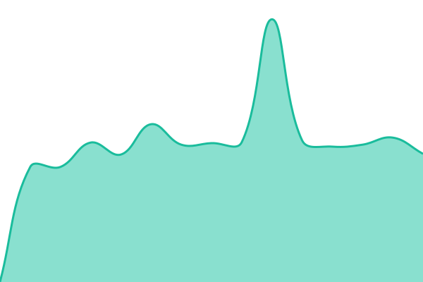

# [📈 Live Status](https://thinkintegrated-web.github.io/upptime): <!--live status--> **🟧 Partial outage**

This repository contains the open-source uptime monitor and status page for [thinkintegrated-web](https://thinkintegrated-web.github.io/upptime), powered by [Upptime](https://github.com/upptime/upptime).

With [Upptime](https://upptime.js.org), you can get your own unlimited and free uptime monitor and status page, powered entirely by a GitHub repository. We use [Issues](https://github.com/thinkintegrated-web/upptime/issues) as incident reports, [Actions](https://github.com/thinkintegrated-web/upptime/actions) as uptime monitors, and [Pages](https://thinkintegrated-web.github.io/upptime) for the status page.

<!--start: status pages-->
<!-- This summary is generated by Upptime (https://github.com/upptime/upptime) -->
<!-- Do not edit this manually, your changes will be overwritten -->
<!-- prettier-ignore -->
| URL | Status | History | Response Time | Uptime |
| --- | ------ | ------- | ------------- | ------ |
|  [abbottcg.com](http://abbottcg.com) | 🟩 Up | [abbottcg-com.yml](https://github.com/thinkintegrated-web/upptime/commits/HEAD/history/abbottcg-com.yml) | 

 420ms
     
 | 

<a href="https://thinkintegrated-web.github.io/upptime/history/abbottcg-com">100.00%</a>
    

|  [animaltrappersinorlando.com](http://animaltrappersinorlando.com) | 🟩 Up | [animaltrappersinorlando-com.yml](https://github.com/thinkintegrated-web/upptime/commits/HEAD/history/animaltrappersinorlando-com.yml) | 

 3132ms
     
 | 

<a href="https://thinkintegrated-web.github.io/upptime/history/animaltrappersinorlando-com">100.00%</a>
    

|  [avancent.com](https://www.avancent.com) | 🟩 Up | [avancent-com.yml](https://github.com/thinkintegrated-web/upptime/commits/HEAD/history/avancent-com.yml) | 

 3334ms
     
 | 

<a href="https://thinkintegrated-web.github.io/upptime/history/avancent-com">100.00%</a>
    

|  [bcnlawvillages.com](https://www.bcnlawvillages.com) | 🟩 Up | [bcnlawvillages-com.yml](https://github.com/thinkintegrated-web/upptime/commits/HEAD/history/bcnlawvillages-com.yml) | 

 2312ms
     
 | 

<a href="https://thinkintegrated-web.github.io/upptime/history/bcnlawvillages-com">100.00%</a>
    

|  [bhpchamber.org](https://www.bhpchamber.org) | 🟩 Up | [bhpchamber-org.yml](https://github.com/thinkintegrated-web/upptime/commits/HEAD/history/bhpchamber-org.yml) | 

 1465ms
     
 | 

<a href="https://thinkintegrated-web.github.io/upptime/history/bhpchamber-org">100.00%</a>
    

|  [cableelectrical.com](https://www.cableelectrical.com) | 🟩 Up | [cableelectrical-com.yml](https://github.com/thinkintegrated-web/upptime/commits/HEAD/history/cableelectrical-com.yml) | 

 980ms
     
 | 

<a href="https://thinkintegrated-web.github.io/upptime/history/cableelectrical-com">100.00%</a>
    

|  [congdonyards.com](https://www.congdonyards.com) | 🟩 Up | [congdonyards-com.yml](https://github.com/thinkintegrated-web/upptime/commits/HEAD/history/congdonyards-com.yml) | 

 1559ms
     
 | 

<a href="https://thinkintegrated-web.github.io/upptime/history/congdonyards-com">100.00%</a>
    

|  [consolidatedcoating.com](https://www.consolidatedcoating.com) | 🟩 Up | [consolidatedcoating-com.yml](https://github.com/thinkintegrated-web/upptime/commits/HEAD/history/consolidatedcoating-com.yml) | 

 2691ms
     
 | 

<a href="https://thinkintegrated-web.github.io/upptime/history/consolidatedcoating-com">100.00%</a>
    

|  [critter-control.com](https://www.critter-control.com) | 🟩 Up | [critter-control-com.yml](https://github.com/thinkintegrated-web/upptime/commits/HEAD/history/critter-control-com.yml) | 

 1872ms
     
 | 

<a href="https://thinkintegrated-web.github.io/upptime/history/critter-control-com">100.00%</a>
    

|  [crittercontrolofboston.com](https://www.crittercontrolofboston.com) | 🟩 Up | [crittercontrolofboston-com.yml](https://github.com/thinkintegrated-web/upptime/commits/HEAD/history/crittercontrolofboston-com.yml) | 

 1160ms
     
 | 

<a href="https://thinkintegrated-web.github.io/upptime/history/crittercontrolofboston-com">100.00%</a>
    

|  [crittercontrolofpittsburgh.com](https://crittercontrolofpittsburgh.com) | 🟩 Up | [crittercontrolofpittsburgh-com.yml](https://github.com/thinkintegrated-web/upptime/commits/HEAD/history/crittercontrolofpittsburgh-com.yml) | 

 1170ms
     
 | 

<a href="https://thinkintegrated-web.github.io/upptime/history/crittercontrolofpittsburgh-com">100.00%</a>
    

|  [cshpinnovation.com](https://www.cshpinnovation.com) | 🟥 Down | [cshpinnovation-com.yml](https://github.com/thinkintegrated-web/upptime/commits/HEAD/history/cshpinnovation-com.yml) | 

 0ms
     
 | 

<a href="https://thinkintegrated-web.github.io/upptime/history/cshpinnovation-com">0.00%</a>
    

|  [destinyfamilyoffice.com](https://www.destinyfamilyoffice.com) | 🟩 Up | [destinyfamilyoffice-com.yml](https://github.com/thinkintegrated-web/upptime/commits/HEAD/history/destinyfamilyoffice-com.yml) | 

 508ms
     
 | 

<a href="https://thinkintegrated-web.github.io/upptime/history/destinyfamilyoffice-com">100.00%</a>
    

|  [eventsatcongdonyards.com](https://www.eventsatcongdonyards.com) | 🟩 Up | [eventsatcongdonyards-com.yml](https://github.com/thinkintegrated-web/upptime/commits/HEAD/history/eventsatcongdonyards-com.yml) | 

 3613ms
     
 | 

<a href="https://thinkintegrated-web.github.io/upptime/history/eventsatcongdonyards-com">100.00%</a>
    

|  [integralandcompany.com](https://www.integralandcompany.com) | 🟩 Up | [integralandcompany-com.yml](https://github.com/thinkintegrated-web/upptime/commits/HEAD/history/integralandcompany-com.yml) | 

 2698ms
     
 | 

<a href="https://thinkintegrated-web.github.io/upptime/history/integralandcompany-com">100.00%</a>
    

|  [jobspartnership.org](https://www.jobspartnership.org) | 🟩 Up | [jobspartnership-org.yml](https://github.com/thinkintegrated-web/upptime/commits/HEAD/history/jobspartnership-org.yml) | 

 1583ms
     
 | 

<a href="https://thinkintegrated-web.github.io/upptime/history/jobspartnership-org">100.00%</a>
    

|  [matthiaspw.com](https://www.matthiaspw.com) | 🟩 Up | [matthiaspw-com.yml](https://github.com/thinkintegrated-web/upptime/commits/HEAD/history/matthiaspw-com.yml) | 

 1158ms
     
 | 

<a href="https://thinkintegrated-web.github.io/upptime/history/matthiaspw-com">100.00%</a>
    

|  [nicholswealth.com](https://www.nicholswealth.com) | 🟩 Up | [nicholswealth-com.yml](https://github.com/thinkintegrated-web/upptime/commits/HEAD/history/nicholswealth-com.yml) | 

 650ms
     
 | 

<a href="https://thinkintegrated-web.github.io/upptime/history/nicholswealth-com">100.00%</a>
    

|  [orlandoballet.org](https://www.orlandoballet.org) | 🟩 Up | [orlandoballet-org.yml](https://github.com/thinkintegrated-web/upptime/commits/HEAD/history/orlandoballet-org.yml) | 

 2134ms
     
 | 

<a href="https://thinkintegrated-web.github.io/upptime/history/orlandoballet-org">100.00%</a>
    

|  [starterstudio.org](https://www.starterstudio.org) | 🟩 Up | [starterstudio-org.yml](https://github.com/thinkintegrated-web/upptime/commits/HEAD/history/starterstudio-org.yml) | 

 1253ms
     
 | 

<a href="https://thinkintegrated-web.github.io/upptime/history/starterstudio-org">100.00%</a>
    

|  [cableelectrical.com](https://www.cableelectrical.com) | 🟩 Up | [cableelectrical-com.yml](https://github.com/thinkintegrated-web/upptime/commits/HEAD/history/cableelectrical-com.yml) | 

 980ms
     
 | 

<a href="https://thinkintegrated-web.github.io/upptime/history/cableelectrical-com">100.00%</a>
    

|  [unlimitedwelding.com](https://www.unlimitedwelding.com) | 🟩 Up | [unlimitedwelding-com.yml](https://github.com/thinkintegrated-web/upptime/commits/HEAD/history/unlimitedwelding-com.yml) | 

 1010ms
     
 | 

<a href="https://thinkintegrated-web.github.io/upptime/history/unlimitedwelding-com">100.00%</a>
    

|  [3nineorlando.com](https://www.3nineorlando.com) | 🟩 Up | [3nineorlando-com.yml](https://github.com/thinkintegrated-web/upptime/commits/HEAD/history/3nineorlando-com.yml) | 

 2760ms
     
 | 

<a href="https://thinkintegrated-web.github.io/upptime/history/3nineorlando-com">100.00%</a>
    

|  [amr-foundation.com](https://www.amr-foundation.com) | 🟩 Up | [amr-foundation-com.yml](https://github.com/thinkintegrated-web/upptime/commits/HEAD/history/amr-foundation-com.yml) | 

 2415ms
     
 | 

<a href="https://thinkintegrated-web.github.io/upptime/history/amr-foundation-com">100.00%</a>
    

|  [askrosen.com](https://www.askrosen.com) | 🟩 Up | [askrosen-com.yml](https://github.com/thinkintegrated-web/upptime/commits/HEAD/history/askrosen-com.yml) | 

 1824ms
     
 | 

<a href="https://thinkintegrated-web.github.io/upptime/history/askrosen-com">100.00%</a>
    

|  [calabellarestaurant.com](https://www.calabellarestaurant.com) | 🟩 Up | [calabellarestaurant-com.yml](https://github.com/thinkintegrated-web/upptime/commits/HEAD/history/calabellarestaurant-com.yml) | 

 332ms
     
 | 

<a href="https://thinkintegrated-web.github.io/upptime/history/calabellarestaurant-com">100.00%</a>
    

|  [evergladesrestaurant.com](https://www.evergladesrestaurant.com) | 🟩 Up | [evergladesrestaurant-com.yml](https://github.com/thinkintegrated-web/upptime/commits/HEAD/history/evergladesrestaurant-com.yml) | 

 1813ms
     
 | 

<a href="https://thinkintegrated-web.github.io/upptime/history/evergladesrestaurant-com">100.00%</a>
    

|  [fitdeputy.com](https://www.fitdeputy.com) | 🟩 Up | [fitdeputy-com.yml](https://github.com/thinkintegrated-web/upptime/commits/HEAD/history/fitdeputy-com.yml) | 

 1645ms
     
 | 

<a href="https://thinkintegrated-web.github.io/upptime/history/fitdeputy-com">100.00%</a>
    

|  [harryspoolside.com](https://www.harryspoolside.com) | 🟩 Up | [harryspoolside-com.yml](https://github.com/thinkintegrated-web/upptime/commits/HEAD/history/harryspoolside-com.yml) | 

 1678ms
     
 | 

<a href="https://thinkintegrated-web.github.io/upptime/history/harryspoolside-com">100.00%</a>
    

|  [jacksplacerestaurant.com](https://www.jacksplacerestaurant.com) | 🟩 Up | [jacksplacerestaurant-com.yml](https://github.com/thinkintegrated-web/upptime/commits/HEAD/history/jacksplacerestaurant-com.yml) | 

 2035ms
     
 | 

<a href="https://thinkintegrated-web.github.io/upptime/history/jacksplacerestaurant-com">100.00%</a>
    

|  [landrememberedrestaurant.com](https://www.landrememberedrestaurant.com) | 🟩 Up | [landrememberedrestaurant-com.yml](https://github.com/thinkintegrated-web/upptime/commits/HEAD/history/landrememberedrestaurant-com.yml) | 

 546ms
     
 | 

<a href="https://thinkintegrated-web.github.io/upptime/history/landrememberedrestaurant-com">100.00%</a>
    

|  [orlandohotels4less.com](https://www.orlandohotels4less.com) | 🟩 Up | [orlandohotels4less-com.yml](https://github.com/thinkintegrated-web/upptime/commits/HEAD/history/orlandohotels4less-com.yml) | 

 911ms
     
 | 

<a href="https://thinkintegrated-web.github.io/upptime/history/orlandohotels4less-com">100.00%</a>
    

|  [pinecrestprogram.com](https://www.pinecrestprogram.com) | 🟩 Up | [pinecrestprogram-com.yml](https://github.com/thinkintegrated-web/upptime/commits/HEAD/history/pinecrestprogram-com.yml) | 

 11444ms
     
 | 

<a href="https://thinkintegrated-web.github.io/upptime/history/pinecrestprogram-com">89.02%</a>
    

|  [repo2.rosenhotels.com](https://repo2.rosenhotels.com) | 🟩 Up | [repo2-rosenhotels-com.yml](https://github.com/thinkintegrated-web/upptime/commits/HEAD/history/repo2-rosenhotels-com.yml) | 

 342ms
     
 | 

<a href="https://thinkintegrated-web.github.io/upptime/history/repo2-rosenhotels-com">100.00%</a>
    

|  [rfp.rosenhotels.com](https://rfp.rosenhotels.com) | 🟥 Down | [rfp-rosenhotels-com.yml](https://github.com/thinkintegrated-web/upptime/commits/HEAD/history/rfp-rosenhotels-com.yml) | 

 0ms
     
 | 

<a href="https://thinkintegrated-web.github.io/upptime/history/rfp-rosenhotels-com">0.00%</a>
    

|  [rosen50.com](https://www.rosen50.com) | 🟩 Up | [rosen50-com.yml](https://github.com/thinkintegrated-web/upptime/commits/HEAD/history/rosen50-com.yml) | 

 3170ms
     
 | 

<a href="https://thinkintegrated-web.github.io/upptime/history/rosen50-com">100.00%</a>
    

|  [rosenaquatic.com](https://www.rosenaquatic.com) | 🟩 Up | [rosenaquatic-com.yml](https://github.com/thinkintegrated-web/upptime/commits/HEAD/history/rosenaquatic-com.yml) | 

 403ms
     
 | 

<a href="https://thinkintegrated-web.github.io/upptime/history/rosenaquatic-com">100.00%</a>
    

|  [rosenbellavista.com](https://www.rosenbellavista.com) | 🟥 Down | [rosenbellavista-com.yml](https://github.com/thinkintegrated-web/upptime/commits/HEAD/history/rosenbellavista-com.yml) | 

 0ms
     
 | 

<a href="https://thinkintegrated-web.github.io/upptime/history/rosenbellavista-com">0.00%</a>
    

|  [rosencare.com](https://www.rosencare.com) | 🟩 Up | [rosencare-com.yml](https://github.com/thinkintegrated-web/upptime/commits/HEAD/history/rosencare-com.yml) | 

 1750ms
     
 | 

<a href="https://thinkintegrated-web.github.io/upptime/history/rosencare-com">100.00%</a>
    

|  [rosencentre.com](https://www.rosencentre.com) | 🟩 Up | [rosencentre-com.yml](https://github.com/thinkintegrated-web/upptime/commits/HEAD/history/rosencentre-com.yml) | 

 2175ms
     
 | 

<a href="https://thinkintegrated-web.github.io/upptime/history/rosencentre-com">100.00%</a>
    

|  [rosengivesback.com](https://www.rosengivesback.com) | 🟩 Up | [rosengivesback-com.yml](https://github.com/thinkintegrated-web/upptime/commits/HEAD/history/rosengivesback-com.yml) | 

 1657ms
     
 | 

<a href="https://thinkintegrated-web.github.io/upptime/history/rosengivesback-com">100.00%</a>
    

|  [rosenhotels.com](https://www.rosenhotels.com) | 🟩 Up | [rosenhotels-com.yml](https://github.com/thinkintegrated-web/upptime/commits/HEAD/history/rosenhotels-com.yml) | 

 438ms
     
 | 

<a href="https://thinkintegrated-web.github.io/upptime/history/rosenhotels-com">100.00%</a>
    

|  [rosenmedicalcenter.com](https://www.rosenmedicalcenter.com) | 🟩 Up | [rosenmedicalcenter-com.yml](https://github.com/thinkintegrated-web/upptime/commits/HEAD/history/rosenmedicalcenter-com.yml) | 

 1791ms
     
 | 

<a href="https://thinkintegrated-web.github.io/upptime/history/rosenmedicalcenter-com">100.00%</a>
    

|  [rosenplaza.com](https://www.rosenplaza.com) | 🟩 Up | [rosenplaza-com.yml](https://github.com/thinkintegrated-web/upptime/commits/HEAD/history/rosenplaza-com.yml) | 

 415ms
     
 | 

<a href="https://thinkintegrated-web.github.io/upptime/history/rosenplaza-com">100.00%</a>
    

|  [rosenpreschool.com](https://www.rosenpreschool.com) | 🟩 Up | [rosenpreschool-com.yml](https://github.com/thinkintegrated-web/upptime/commits/HEAD/history/rosenpreschool-com.yml) | 

 1543ms
     
 | 

<a href="https://thinkintegrated-web.github.io/upptime/history/rosenpreschool-com">100.00%</a>
    

|  [rosenrevealed.com](https://www.rosenrevealed.com) | 🟥 Down | [rosenrevealed-com.yml](https://github.com/thinkintegrated-web/upptime/commits/HEAD/history/rosenrevealed-com.yml) | 

 0ms
     
 | 

<a href="https://thinkintegrated-web.github.io/upptime/history/rosenrevealed-com">0.00%</a>
    

|  [rosenshinglecreek.com](https://www.rosenshinglecreek.com) | 🟩 Up | [rosenshinglecreek-com.yml](https://github.com/thinkintegrated-web/upptime/commits/HEAD/history/rosenshinglecreek-com.yml) | 

 414ms
     
 | 

<a href="https://thinkintegrated-web.github.io/upptime/history/rosenshinglecreek-com">100.00%</a>
    

|  [rosensure.com](https://www.rosensure.com) | 🟩 Up | [rosensure-com.yml](https://github.com/thinkintegrated-web/upptime/commits/HEAD/history/rosensure-com.yml) | 

 1337ms
     
 | 

<a href="https://thinkintegrated-web.github.io/upptime/history/rosensure-com">100.00%</a>
    

|  [rosenweddings.com](https://www.rosenweddings.com) | 🟩 Up | [rosenweddings-com.yml](https://github.com/thinkintegrated-web/upptime/commits/HEAD/history/rosenweddings-com.yml) | 

 3048ms
     
 | 

<a href="https://thinkintegrated-web.github.io/upptime/history/rosenweddings-com">100.00%</a>
    

|  [shinglecreekgolf.com](https://www.shinglecreekgolf.com) | 🟩 Up | [shinglecreekgolf-com.yml](https://github.com/thinkintegrated-web/upptime/commits/HEAD/history/shinglecreekgolf-com.yml) | 

 1593ms
     
 | 

<a href="https://thinkintegrated-web.github.io/upptime/history/shinglecreekgolf-com">100.00%</a>
    

|  [spaatrosencentre.com](https://www.spaatrosencentre.com) | 🟩 Up | [spaatrosencentre-com.yml](https://github.com/thinkintegrated-web/upptime/commits/HEAD/history/spaatrosencentre-com.yml) | 

 3967ms
     
 | 

<a href="https://thinkintegrated-web.github.io/upptime/history/spaatrosencentre-com">100.00%</a>
    

|  [spaatshinglecreek.com](https://www.spaatshinglecreek.com) | 🟩 Up | [spaatshinglecreek-com.yml](https://github.com/thinkintegrated-web/upptime/commits/HEAD/history/spaatshinglecreek-com.yml) | 

 2804ms
     
 | 

<a href="https://thinkintegrated-web.github.io/upptime/history/spaatshinglecreek-com">100.00%</a>
    

|  [wifi.rosencentre.com](https://wifi.rosencentre.com) | 🟩 Up | [wifi-rosencentre-com.yml](https://github.com/thinkintegrated-web/upptime/commits/HEAD/history/wifi-rosencentre-com.yml) | 

 4061ms
     
 | 

<a href="https://thinkintegrated-web.github.io/upptime/history/wifi-rosencentre-com">100.00%</a>
    

|  [wifi.roseninn6327.com](https://wifi.roseninn6327.com) | 🟩 Up | [wifi-roseninn6327-com.yml](https://github.com/thinkintegrated-web/upptime/commits/HEAD/history/wifi-roseninn6327-com.yml) | 

 1051ms
     
 | 

<a href="https://thinkintegrated-web.github.io/upptime/history/wifi-roseninn6327-com">100.00%</a>
    

|  [wifi.roseninn7600.com](https://wifi.roseninn7600.com) | 🟩 Up | [wifi-roseninn7600-com.yml](https://github.com/thinkintegrated-web/upptime/commits/HEAD/history/wifi-roseninn7600-com.yml) | 

 1099ms
     
 | 

<a href="https://thinkintegrated-web.github.io/upptime/history/wifi-roseninn7600-com">100.00%</a>
    

|  [wifi.roseninn9000.com](https://wifi.roseninn9000.com) | 🟩 Up | [wifi-roseninn9000-com.yml](https://github.com/thinkintegrated-web/upptime/commits/HEAD/history/wifi-roseninn9000-com.yml) | 

 1046ms
     
 | 

<a href="https://thinkintegrated-web.github.io/upptime/history/wifi-roseninn9000-com">100.00%</a>
    

|  [wifi.rosenplaza.com](https://wifi.rosenplaza.com) | 🟩 Up | [wifi-rosenplaza-com.yml](https://github.com/thinkintegrated-web/upptime/commits/HEAD/history/wifi-rosenplaza-com.yml) | 

 2249ms
     
 | 

<a href="https://thinkintegrated-web.github.io/upptime/history/wifi-rosenplaza-com">100.00%</a>
    

|  [wifi.rosenshinglecreek.com](https://wifi.rosenshinglecreek.com) | 🟩 Up | [wifi-rosenshinglecreek-com.yml](https://github.com/thinkintegrated-web/upptime/commits/HEAD/history/wifi-rosenshinglecreek-com.yml) | 

 2447ms
     
 | 

<a href="https://thinkintegrated-web.github.io/upptime/history/wifi-rosenshinglecreek-com">100.00%</a>
    

<!--end: status pages-->

[**Visit our status website →**](https://thinkintegrated-web.github.io/upptime)

## 📄 License

- Powered by: [Upptime](https://github.com/upptime/upptime)
- Code: [MIT](./LICENSE) © [Anand Chowdhary](https://anandchowdhary.com), supported by [Pabio](https://pabio.com)
- Data in the `./history` directory: [Open Database License](https://opendatacommons.org/licenses/odbl/1-0/)
